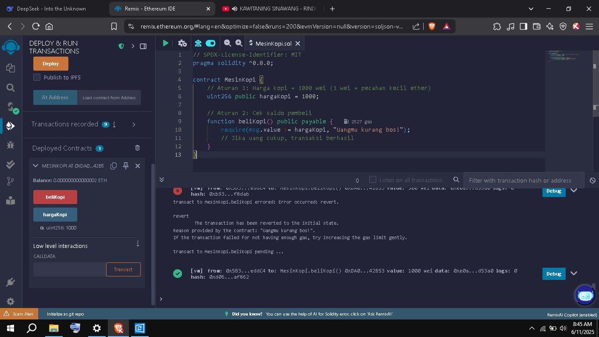
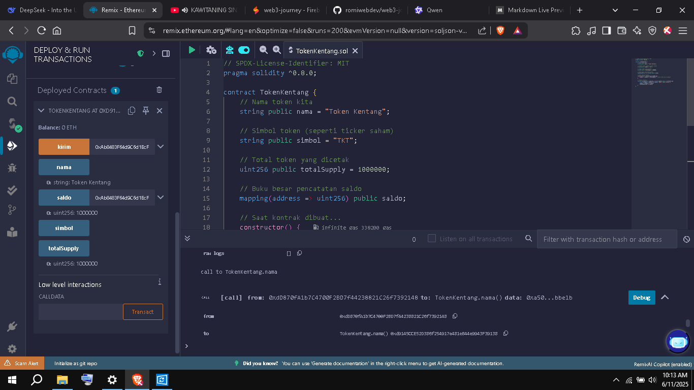

# 📘 Progress Belajar Web3

 # Hari 1

## 🧠 Materi yang Dipelajari

- **Web3** adalah konsep internet generasi berikutnya yang terdesentralisasi.
- Data dan kontrol tidak dikuasai oleh satu pihak (seperti perusahaan besar), melainkan tersebar di jaringan pengguna.
- Salah satu teknologi inti Web3 adalah **Blockchain**, yaitu sistem pencatatan data transaksi secara aman, transparan, dan tidak dapat diubah sembarangan.
- Blockchain menyimpan data di banyak komputer (node), sehingga memastikan keamanan dan ketahanan jaringan.

## 💻 Praktik Hari Ini

### Mencoba Demo Blockchain
Saya mencoba mengunjungi [Blockchain Demo](https://blockchaindemo.io/) untuk simulasi visual blockchain.

## 📜 Smart Contract Pertama: Mesin Kopi Digital

### 🧩 Konsep Dasar

Saya mulai dengan membuat analogi sederhana: **mesin kopi digital berbasis smart contract**. Konsep ini membantu memahami bagaimana logika bisnis bisa diotomatisasi di atas blockchain.

### 💡 Cara Kerja:
- Pengguna mengirim sejumlah ether sebagai pembayaran.
- Jika nilai yang dikirim sesuai atau melebihi harga kopi (misalnya `1 ether`), maka kopi "dikeluarkan" (simulasi lewat event atau token).
- Jika nilai kurang dari yang dibutuhkan, smart contract memicu error dan tidak memproses transaksi.
- Uang otomatis dikembalikan jika kondisi tidak terpenuhi.


### 🔗 Link untuk Mencoba:
👉 [Coba di Remix Ethereum IDE](https://remix.ethereum.org/)

### 🧑‍💻 Contoh Kode Solidity Lengkap:

```solidity
// SPDX-License-Identifier: MIT
pragma solidity ^0.8.0;

contract CoffeeMachine {
    uint256 public price = 1 ether;

    event CoffeeDispensed(address indexed buyer);

    function buyCoffee() public payable {
        require(msg.value >= price, "Uang tidak cukup!");

        emit CoffeeDispensed(msg.sender);
    }

    function refund() public {
        payable(msg.sender).transfer(address(this).balance);
    }
}
```

Berikut adalah tampilan smart contract di Remix IDE:



---

# Hari 2

## 🧠 Materi yang Dipelajari
- Membuat token ERC-20 sederhana menggunakan Solidity.
- Mengenal standar token Ethereum: **ERC-20**.
- Memahami konsep `totalSupply`, `balanceOf`, `transfer`, dan event `Transfer`.

## 🚀 Proyek KentangCoin 🥔

### 💡 Deskripsi
Hari ini saya membuat token bernama **KentangCoin (KENTANG)** berbasis standar **ERC-20** di jaringan Ethereum. Token ini memiliki fitur dasar:
- Total supply awal: **1.000.000 KENTANG**
- Fungsi transfer antar wallet
- Event log setiap kali terjadi transfer

### 🔧 Cara Pakai
1. Buka [Remix IDE](https://remix.ethereum.org/)
2. Buat file baru bernama `KentangCoin.sol`
3. Salin kode dari template di bawah
4. Compile dan deploy smart contract
5. Coba fungsi `transfer` ke alamat lain

### 📄 Kode Smart Contract Lengkap

```solidity
// SPDX-License-Identifier: MIT
pragma solidity ^0.8.0;

interface IERC20 {
    function totalSupply() external view returns (uint256);
    function balanceOf(address account) external view returns (uint256);
    function transfer(address recipient, uint256 amount) external returns (bool);
    event Transfer(address indexed from, address indexed to, uint256 value);
}

contract KentangCoin is IERC20 {
    string public constant name = "KentangCoin";
    string public constant symbol = "KENTANG";
    uint8 public constant decimals = 18;

    uint256 private _totalSupply = 1_000_000 * (10 ** uint256(decimals));
    mapping(address => uint256) private _balances;

    constructor() {
        _balances[msg.sender] = _totalSupply;
    }

    function totalSupply() public view override returns (uint256) {
        return _totalSupply;
    }

    function balanceOf(address account) public view override returns (uint256) {
        return _balances[account];
    }

    function transfer(address recipient, uint256 amount) public override returns (bool) {
        require(_balances[msg.sender] >= amount, "Saldo tidak mencukupi");
        _balances[msg.sender] -= amount;
        _balances[recipient] += amount;
        emit Transfer(msg.sender, recipient, amount);
        return true;
    }
}
```

### 🖼️ Screenshot Hasil Deploy




## 📌 Catatan Penting
- Saya menggunakan **standar ERC-20**, sehingga token bisa dikenali oleh wallet seperti MetaMask.
- Token ini belum memiliki fitur approval (`approve`, `allowance`) — akan ditambahkan di hari berikutnya.
- Untuk saat ini, semua token didistribusikan ke akun deployer.

